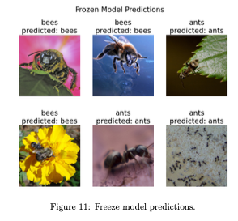

# Fundamental Machine Learning Algorithms and Applications

A comprehensive implementation and analysis of core machine learning algorithms including regression, classification, kernel methods, neural networks, clustering, and dimensionality reduction. This project showcases both theoretical derivations and practical applications in Python.

- **Linear and Logistic Regression:**
  - Implemented closed-form and iterative solutions for linear regression using gradient descent and stochastic gradient descent. Analyzed overfitting and regularization. Developed logistic and softmax regression, derived gradients and Hessians, and applied them for binary and multi-class classification.
  
  

- **Generative Models for Classification:**
  - Built Gaussian Discriminant Analysis (GDA) and generative logistic regression classifiers. Derived maximum likelihood estimators, implemented softmax regression with gradient ascent, and compared results with discriminative models.

  

- **Support Vector Machines and Kernels:**
  - Constructed soft-margin and asymmetric cost SVMs by solving primal optimization problems. Proved kernel validity through construction rules and implemented kernel methods for classification. Analyzed the theoretical basis of RBF and polynomial kernels.

  

- **Deep Learning for Vision and Language:**
  - Applied convolutional neural networks (CNNs) on CIFAR-10 and MNIST datasets. Trained image captioning models using RNNs. Fine-tuned pre-trained networks for transfer learning and explored transformer architectures for image-to-text generation.

  

- **Unsupervised Learning and Representation Learning:**
  - Used K-means and Gaussian Mixture Models (GMMs) for image compression. Developed PCA and ICA pipelines for dimensionality reduction and signal separation. Built conditional variational autoencoders (CVAEs) for generative modeling and semi-supervised learning using the EM algorithm.

  

